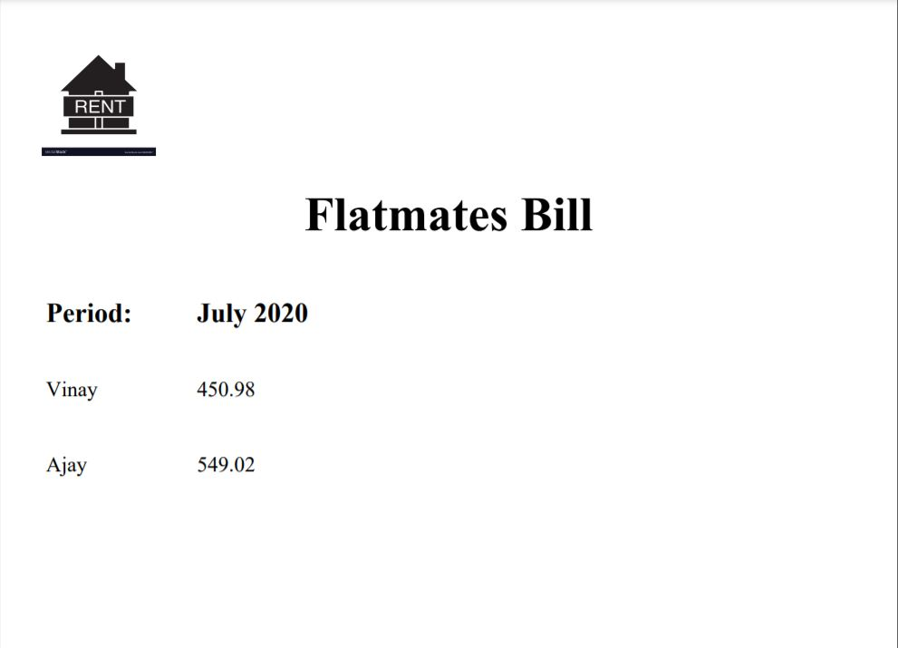

# Python Apps

This repository holds python based apps with CLI or Web interface. All the codes are written in modularized and OOP manner.

## Contents

- ## [WebCam Photo Sharer](https://github.com/vinay-singh27/python-apps/tree/main/Webcam_photo_sharer)

       Objective  :  Allow the user to take a photo through webcam and share it on web
 
------------------------------------------------------------------------

- ## [Flatmate Bill Split Web Application](https://github.com/vinay-singh27/python-apps/tree/main/Flatmates_Bill)
       Objective  :  Split the Bill Amount between the two flatmates
       Input      :  Bill Amount & its time period
                     Flatmate names & days they have stayed in the flat
       Output     :  Generate PDF report with the amount details each user has to pay
       
 Sample of the generated PDF report is below:
 

 
 

                          
-------------------------------------------------------------------------

- ## [Instant Dictionary](https://github.com/vinay-singh27/python-apps/tree/main/Instant_Dictionary)
       Objective  : A web app that lets users type in a term in a text box and returns the English definition of that term instantly as soon as the user has finished typing.
       The web app consists of a website with a navigation menu, a Home, Dictionary, and About page.

-------------------------------------------------------------------------

- ## [Instant Dictionary](https://github.com/vinay-singh27/python-apps/tree/main/Instant_Dictionary)
       Objective  : A web app that lets users type in a term in a text box and returns the English definition of that term instantly as soon as the user has finished typing.
       The web app consists of a website with a navigation menu, a Home, Dictionary, and About page.
 
